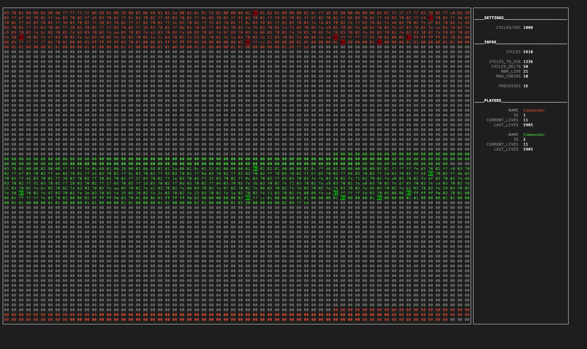

# Corewar 
A team project to build your own virtual machine - 42 School Project


## Goals

* The assembler: this is the program that will compile champions and translate them from the language written them in (assembly language) into “Bytecode”. Bytecode is a machine code, which will be directly interpreted by the virtual machine.
* The virtual machine: It’s the “arena” in which champions will be executed. It offers various functions, all of which will be useful for the battle of the champions. The virtual machine allows for numerous simultaneous processes.
* The champion: It's necessary to create a simple champion just to prove the program functionality.

Look at subject.pdf for more information
## Setup

```
git clone https://github.com/anamsell/Corewar.git corewar
cd corewar
make
```

## Overview



## Commands

### Usage
```
./asm [file.s]
./corewar [-i | -dump N] [-n N] <champion1.cor> <...>
```
-i : Enables visualization

-dump N : Dumps memory after N cycles

-n N : Assigns id N to the player specified right after N

Pay attention! [-i] has higher priority when is used with [-dump]

### Examples
```
./asm commander.s
./corewar commander.cor commander.cor -i
```

## Visualization

* Visualization is enabled using library. The native shell (for example, Terminal.app for macOS) could show higher performance than the third-party applications like iTerm. Colors may vary depend on your shell application settings.
* Use QWER to modify the speed: (in number of process by seconds)
  * Q => decrease by 10
  * W => decrease by 1
  * E => increase by 1
  * R => increase by 10

